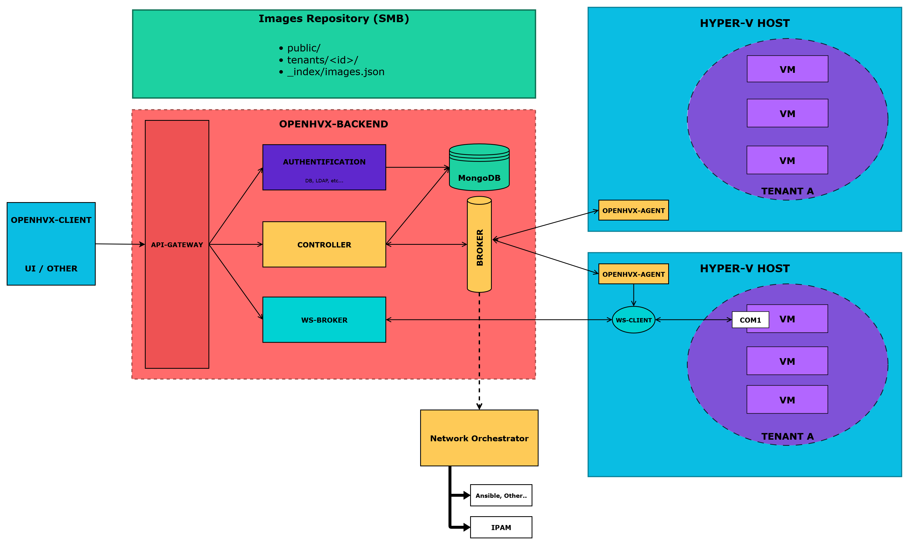

# OpenHVX

**OpenHVX** is an open-source IaaS platform for Hyper-V.  
It is built as a modular ecosystem of services and tools:

- **[openhvx-ui](https://github.com/OpenHVX/openhvx-ui)** – Web UI (Vue3 / Naive UI)  
- **[openhvx-backend](https://github.com/OpenHVX/openhvx-backend)** – Backend (Node.js / Express / MongoDB / RabbitMQ)  
- **[openhvx-agent](https://github.com/OpenHVX/openhvx-agent)** – Agent (Go / PowerShell)  
- **[openhvx-img](https://github.com/OpenHVX/openhvx-img)** – Cloud-init images indexer (Go)  

The goal is to provide a **lightweight, scalable, and self-hostable IaaS platform** for Hyper-V environments.

---
## High-Level Architecture
|  |
|:--:|

🔗 Explore the [documentation](https://github.com/OpenHVX)  
💬 Join the discussion via Issues & PRs
