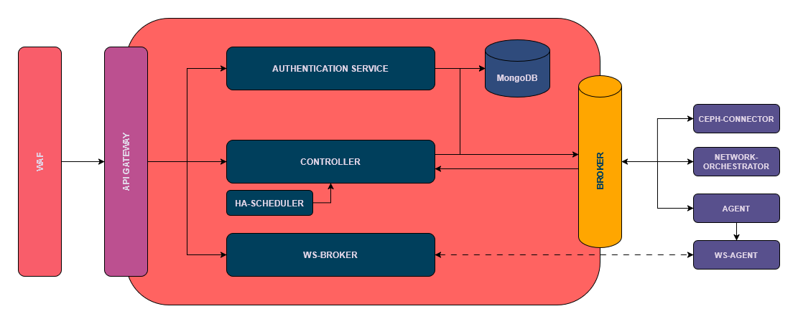

comment l'integrer?
# OpenHVX

**OpenHVX** is an open-source IaaS platform for Hyper-V.  

> **⚠️ Project status:**  
> OpenHVX is currently in active development and **not ready for production**.  
> Features, APIs and configuration files may change without notice until the first stable release.

It is built as a modular ecosystem of services and tools:

- **[openhvx-admin-ui](https://github.com/OpenHVX/openhvx-admin-ui)** – Web Admin UI (Vue3 / Naive UI)
- **[openhvx-tenant-ui](https://github.com/OpenHVX/openhvx-tenant-ui)** – Web Tenant UI (Vue3 / Naive UI) <--- WIP
- **[openhvx-cli](https://github.com/OpenHVX/openhvx-cli)** – Web Tenant UI (Vue3 / Naive UI) <--- WIP    
- **[openhvx-backend](https://github.com/OpenHVX/openhvx-backend)** – Backend - Control Plane (Node.js / Express / MongoDB / RabbitMQ)  
- **[openhvx-agent](https://github.com/OpenHVX/openhvx-agent)** – Agent (Go / PowerShell)  
- **[openhvx-img](https://github.com/OpenHVX/openhvx-img)** – Cloud-init images indexer (Go)  

The goal is to provide a **lightweight, scalable, and self-hostable IaaS platform** for Hyper-V environments.

---
## High-Level Architecture
<picture>
  <source media="(prefers-color-scheme: dark)" srcset="./schema.openvhx.dark.png">
  
</picture>

🔗 Explore the [documentation](https://github.com/OpenHVX)  
💬 Join the discussion via Issues & PRs
